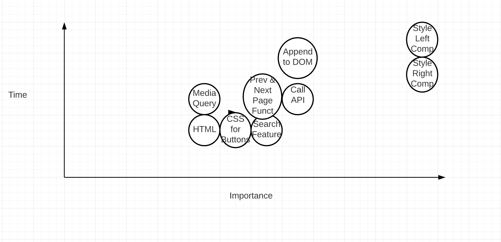

## Project Name

Pokedex

## Project Description

I am recreating a Pokedex which is a digital encyclopedia of Pokemon from it's database. The Pokedex will be fully functional like the one on the show displaying a visual of the Pokemon and it's data on one side and a list index of selectable Pokemon with buttons on the other side. You can read more about the Pokedex here: <https://bulbapedia.bulbagarden.net/wiki/Pok%C3%A9dex>

## API and Data Sample

I'm using the world's most used Pokemon API which averages a million calls a month. https://pokeapi.co/

```json
{
    "abilities": [
        {
            "ability": {
                "name": "overgrow",
                "url": "https://pokeapi.co/api/v2/ability/65/"
            },
            "is_hidden": false,
            "slot": 1
        },
        {
            "ability": {
                "name": "chlorophyll",
                "url": "https://pokeapi.co/api/v2/ability/34/"
            },
            "is_hidden": true,
            "slot": 3
        }
    ],
    "base_experience": 64,
    "forms": [
        {
            "name": "bulbasaur",
            "url": "https://pokeapi.co/api/v2/pokemon-form/1/"
        }
```

## Wireframes

Wireframe link here: https://wireframe.cc/Wuc80r
Wireframe for mobile link here: https://wireframe.cc/iL7XrO

Showing overall layout of my Pokedex with the left container showing a picture of the Pokemon with it's coresponding data. The right container will have a selectable list of Pokemon in order to choose from with buttons to navigate between pages. This container will also have a search field to directly look up Pokemon.

#### MVP 

- Display Pokemon image with it's corresponding data features once selected or searched for 
- Mimic replica look of a [Pokedex](https://bulbapedia.bulbagarden.net/wiki/Pok%C3%A9dex) 
- Ensure navigation between Pokemon indices 

#### PostMVP  

- Add more dynamic media of Pokemon not included in this API
- Add an intro animation that opens up Pokedex when first loaded

## Project Schedule

|  Day | Deliverable | Status
|---|---| ---|
|Feb 22-23| Prompt / Wireframes / Priority Matrix / Timeframes | Incomplete
|Feb 23| Project Approval | Incomplete
|Feb 24| Core Application Structure (HTML, CSS, etc.) | Incomplete
|Feb 24| Pseudocode / actual code | Incomplete
|Feb 25| Initial Clickable Model  | Incomplete
|Feb 26| MVP | Incomplete
|March 1| Presentations | Incomplete

## Priority Matrix

https://lucid.app/lucidchart/invitations/accept/68b26aaf-484a-46d4-800f-8bcc7a33d0b8



## Timeframes

| Component | Priority | Estimated Time | Time Invested | Actual Time |
| --- | :---: |  :---: | :---: | :---: |
| HTML Structure| M | 3hrs| 4hrs | 4hrs |
| Getting Data from API | M | 5hrs| 5hrs | 5hrs |
| Color Scheme in CSS | H | 5hrs | 4hrs | 4hrs |
| Search Functionality | M | 3hrs | 3hrs | 3hrs |
| Prev Page Button Functionality | M | 3hrs | 5hrs | 5hrs |
| Next Page Button Functionality | M | 3hrs | 5hrs | 5hrs |
| Style Navigation Buttons | H | 2hrs | 2hrs | 2hrs |
| Style Search Button & Input | M | 2hrs | 2hrs | 2hrs |
| Style Index | M | 3hrs | 3hrs | 3hrs | 
| Style Left Container | H | 3hrs | 5hrs | 5hrs |
| Responsive Design | H | 3hrs | 5hrs | 5hrs | 
| Media Query | L | 3hrs | 3hrs | 3hrs |
| Total | H | 38hrs| 46hrs | 46hrs |

## Code Snippet

``` const fetchPokeList = url => {
  fetch(url)
    .then(res => res.json())
    .then(data => {
      const { results, previous, next } = data;
      prevUrl = previous;
      nextUrl = next;

      for (let i = 0; i < pokeListItems.length ; i++) {
        const pokeListItem = pokeListItems[i];
        const resultData = results[i];

        if (resultData) {
          const { name, url } = resultData;
          const urlArray = url.split('/'); // We split up array here 
          const id = urlArray[urlArray.length - 2]; // Then access index -2 for "id"
          pokeListItem.textContent = id + '. ' + (name);
        } else {
          pokeListItem.textContent = ''; 
``` 
I appreciated this piece of code here where I was able to make my Pokemon lists be accessed 20 a time per page as stated in my MVP. It involved using the .split method to an array to get to an index needed to append to my Poke list.


## Change Log
This section documents changes in my app.
